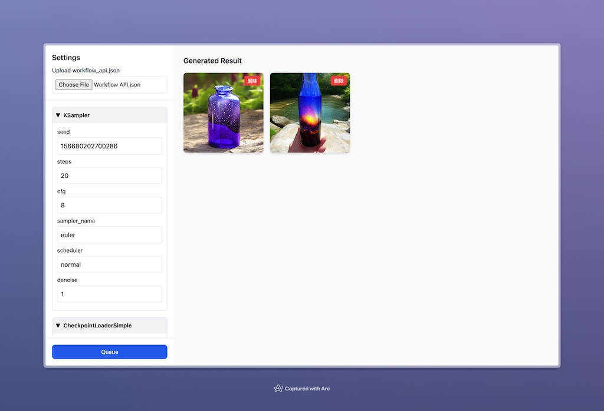

# ComfyUI-WebLite



极简 ComfyUI 前端应用，可以读取 `workflow_api.json` 文件并生成对应的表单，点击 `Queue` 可发起图像生成请求。

## 如何使用

**STEP 1：** 在当前电脑中使用命令启动 ComfyUI

```shell
python main.py --enable-cors-header
```

**STEP 2：** 打开 [jaylyu.github.io/ComfyUI_Web_Lite/](https://jaylyu.github.io/ComfyUI_Web_Lite/) 后，上传 `workflow_api.json` 文件即可使用。

你也可以将仓库克隆到本地使用：

1. 克隆仓库到本地：`git clone https://github.com/JayLyu/ComfyUI_Web_Lite.git`
2. 使用 VsCode 的 *Open with Live Serve* 功能打开 `index.html`
3. 访问：[http://127.0.0.1:5500/index.html](http://127.0.0.1:5500/index.html)


## TODO

- ~~单 html 应用~~
- ~~图片存储在 LocalStorage~~
- ~~样式优化~~
- ~~隐藏特定字段的配置~~
- 生成 checkpoints, loras... 等模型 Select 选择器
